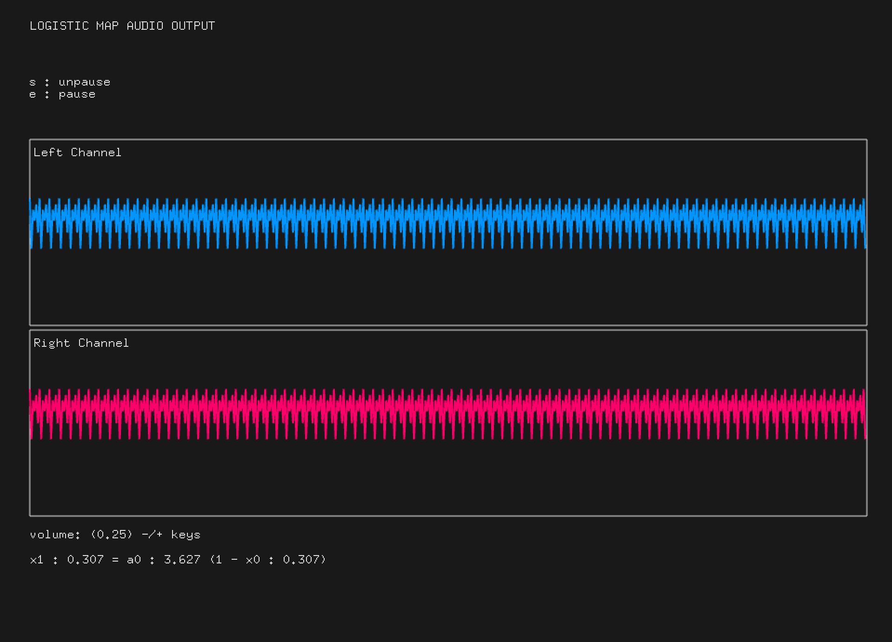

# Logistic Map Audio Output

## Overview

Logistic Map Audio Output is a application to genarate noise from [Logistic Map](https://en.wikipedia.org/wiki/Logistic_map).

This application is made from of [openFrameworks's example](https://github.com/openframeworks/openFrameworks/tree/master/examples/sound/audioOutputExample).